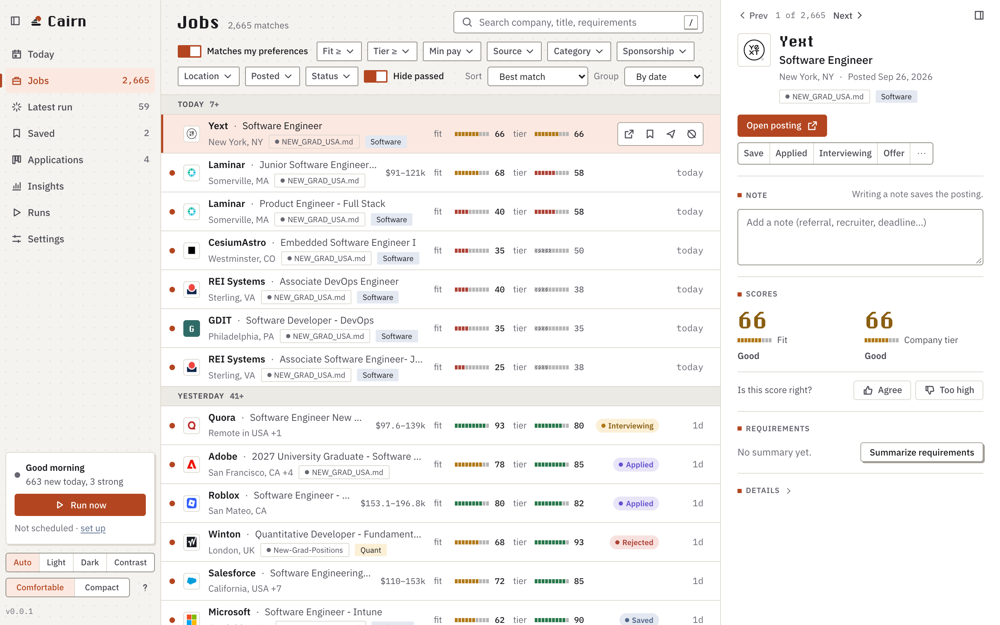
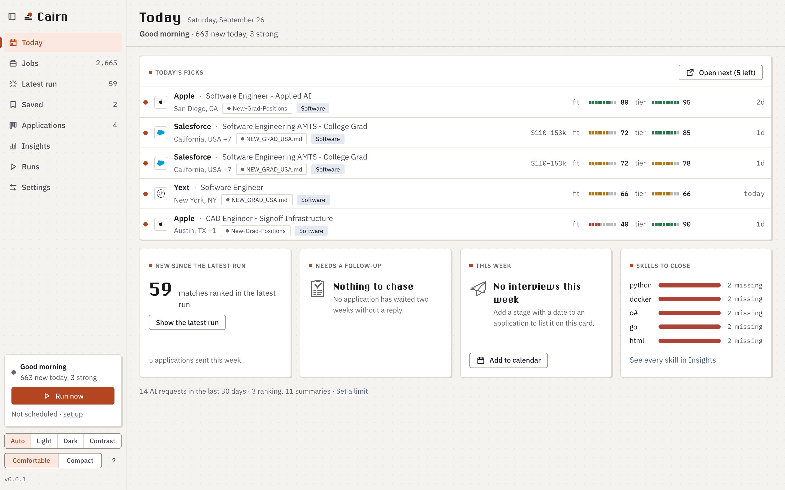
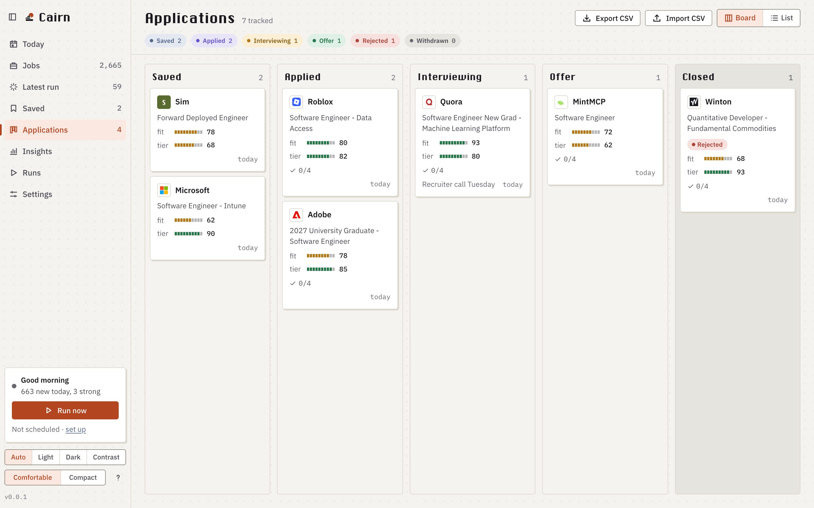

# Cairn

Cairn is a job feed for new-grad and early-career engineers. It runs on your Mac
or Windows PC.

Each day it collects new postings from public job lists and from the job boards of
companies you follow. It hides the ones that don't match what you're looking for,
scores the rest on how well they fit you and how strong the company is, and can
send the best ones to your phone. It also tracks every application, from saved to offer.

Cairn doesn't apply for you, and it doesn't scrape LinkedIn or Indeed. It needs no
account, and everything stays in one folder on your computer.



## What you need

- A Mac with macOS 13 or later, or a PC with Windows 10 or 11.
- Something to score postings with. The default is
  [Claude Code](https://claude.com/claude-code), installed and logged in. You can
  pick another provider instead; see [AI providers](#ai-providers).
- Optional: `pdftotext`, so setup can read a PDF resume. Install it with
  `brew install poppler` on a Mac. On Windows, install
  [Poppler](https://github.com/oschwartz10612/poppler-windows/releases) and add its
  `bin` folder to your PATH. Without it, paste your resume text instead.

## Install

### The Mac app

1. Download `Cairn-<version>.zip` from the
   [latest release](https://github.com/druhinb/cairn/releases/latest).
2. Unzip it and move Cairn into Applications.
3. Open it. macOS will say it can't check the app for malicious software, because
   Cairn isn't signed with an Apple developer certificate yet. Go to
   System Settings › Privacy & Security, scroll down, and click Open Anyway.

The app runs on Macs with Apple silicon. There is no app download for Windows or
Intel Macs; use the command line install below.

### The command line

Install [uv](https://docs.astral.sh/uv/). On a Mac, run `brew install uv`. On
Windows, run this in PowerShell:

```
powershell -ExecutionPolicy ByPass -c "irm https://astral.sh/uv/install.ps1 | iex"
```

Then, in Terminal or PowerShell:

```
uv tool install git+https://github.com/druhinb/cairn
```

`pipx install git+https://github.com/druhinb/cairn` works too. This needs Python
3.11 or later; uv installs it for you. Then run `cairn ui` to open the app.

## Getting started

The first time Cairn opens, setup walks you through three steps:

1. Upload your resume. Cairn drafts a profile from it: the roles you want, where
   you want to work, and which companies you rate highly.
2. Check the profile and fix anything it got wrong.
3. Answer a few quick questions, one card at a time: internships, new grad
   jobs or both, the roles you want, locations, graduation date and work
   authorization, experience, internship terms and how far back to look for
   postings. Cairn fills in the answers it can from your resume, and you can
   change them. Turn on Advanced options to edit the job title lists and
   degrees too.

Then the first search runs, and you can watch its progress. It scores every
posting that matches your preferences, so later runs only bring new postings.

To run setup again, open Settings and click Redo setup.

From the command line, the same steps are:

```
cairn init --from-resume resume.pdf   # draft profile.md and config.toml
cairn doctor                          # check Python, Claude Code, your files
cairn seed                            # mark today's backlog seen
cairn ui                              # open the app
```

`init --from-resume` makes one call to your AI provider, then asks the setup
questions. `.txt` and `.md` resumes work too. Plain `cairn init` writes example
files for a made-up candidate that you edit by hand. `seed` makes the first run
score only postings that appear after it, and `doctor` prints the fix for every
check that fails.

## Updating

When Cairn opens, it checks for a new version, at most once a day. A new version
shows up in the sidebar, and in the menu bar on a Mac.

- The app: download the new zip from the release page and replace Cairn in
  Applications.
- The command line: run `uv tool upgrade cairn-jobs`, or `pipx upgrade cairn-jobs`
  if you installed with pipx.

Your jobs, notes and settings stay as they are.

## Using Cairn

`cairn ui` opens Cairn in its own window, and `cairn ui --no-window` opens it in
your browser. The sidebar lists the views and the current run. The middle pane
lists postings, and the right pane shows the one you picked.

**Today** is where Cairn opens. It lists today's picks, with a button that opens
the next one, and four cards: how many postings the latest run scored,
applications that have waited two weeks without a reply, this week's interviews,
and the skills your best matches ask for that your profile lacks. Under the cards
is how many AI requests Cairn made in the last 30 days.



**Jobs** lists every posting that matches your preferences, best first. Turn off
*Matches my preferences* to see the whole feed. Postings posted more than
*Recent days* ago stay out of both unless you gave them a status. Postings with
a fit under your fit threshold are hidden too; *Show them*, beside the match
count, brings them back. A role one company lists in several cities is one row,
and its details link to the other places. Filters
narrow the list by fit, company score, source, category, location, age and
status. *Hide passed* is on by default. Search looks at the company, title,
requirements, location, category and internship term, so *Winter 2027* lists the
postings for that term. You can group by date or company, or sort by newest,
company or recently updated.

Click a posting to see both scores and the reason for each, a summary of its
requirements (or a *Summarize requirements* button), a note that saves as you
type, its status history and the original posting details.

**Latest run** shows the postings the newest run scored. **Saved** shows everything
you saved.

**Applications** follows each application from saved to applied, interviewing and
offer, or rejected or withdrawn. The board has a column for each stage, with
rejected and withdrawn together under Closed. Drag a card to move it, or select it
and press `[` or `]`. The list view is a table you can sort. Export CSV saves your
applications, and Import CSV shows a preview first, matches rows to postings by id
or link, and lists the rows it couldn't match.



**Insights** has the full list of missing skills, how far your applications got,
how fast replies came, how many you sent each week, which lists your applications
and interviews came from, companies with several strong postings that you don't
follow yet, and your AI requests by kind.

**Runs** starts a run and shows its progress and log as it goes. You can limit how
many postings it takes, change the fit cutoff for that run, or do a dry run that
changes nothing. Past runs are listed below; click one to read its log.

**Settings** has every setting in `config.toml`, and checks each value as you
type. It also has an editor for `profile.md`, the notes Cairn compares every job
to. From Settings you can add feeds and companies, turn the
daily run on or off, and run the checkup.

### Other things worth knowing

- `⌘K` opens a list of every action: go to a view, pin the current filters, switch
  theme, fetch company icons, run now, open a Settings section, or search Jobs.
- The sidebar footer switches between the Auto, Light, Dark and Contrast themes
  (Auto follows your computer's contrast setting), and between comfortable and
  compact rows.
- A five-step tour shows the main controls on your first visit. Take the tour, in
  the `⌘K` list or the shortcuts panel, shows it again.
- In Jobs, Shift-click or `⇧J`/`⇧K` selects several postings. Then `x`, `s` or `a`
  acts on all of them, and one Undo reverses it.
- If you open a posting and come back within half an hour, Cairn asks whether you
  applied.
- Passing on a posting hides it in Jobs and Applications. The Status filter still
  finds it.

### Keyboard shortcuts

On Windows, use Ctrl where this list says `⌘`.

| Key | Action |
|---|---|
| `j` / `k` (or `↓` / `↑`) | Next / previous posting |
| `Enter` / `o` | Open the posting |
| `s` | Save |
| `a` | Mark applied |
| `x` | Pass |
| `n` | Write a note |
| `/` | Search |
| `⌘K` | Command palette |
| `⇧J` / `⇧K` | Select the next / previous posting too |
| `Esc` | Close a popover or panel, clear the search or the selection |
| `1`–`8` | Today, Jobs, Latest run, Saved, Applications, Insights, Runs, Settings |
| `g` / `G` | Agree with the score / score too high |
| `[` / `]` | Move an application card a column left / right |
| `r` | Run now |
| `?` | Show every shortcut |

## Where postings come from

By default Cairn reads five public lists:

| List | What's in it |
|---|---|
| SimplifyJobs `New-Grad-Positions` | new-grad and early-career full-time roles |
| SimplifyJobs `Summer2027-Internships` | internships, with their terms |
| vanshb03 `New-Grad-2026` | new-grad roles, without categories |
| vanshb03 `Summer2027-Internships` | internships, one season each |
| speedyapply `2027-SWE-College-Jobs` | new-grad software roles in the US |

The same job listed in several places shows up once. Cities are matched however a
list spells them, so NYC, New York City and New York, NY are the same place.

### Companies you follow

Add a company in Settings › Sources by name or by the link to its job board. Cairn
reads that company's public board:

| Board | Add by | Board URL |
|---|---|---|
| Greenhouse | name or URL | `boards.greenhouse.io/stripe` |
| Lever | name or URL | `jobs.lever.co/palantir` |
| Ashby | name or URL | `jobs.ashbyhq.com/openai` |
| SmartRecruiters | name or URL | `jobs.smartrecruiters.com/ServiceNow` |
| Workable | name or URL | `apply.workable.com/huggingface` |
| BambooHR | name or URL | `rei.bamboohr.com/careers` |
| Workday | URL only | `nvidia.wd5.myworkdayjobs.com/NVIDIAExternalCareerSite` |

Cairn tries a name on each board in this order and uses the first one that lists a
job. Workday needs the link, because a name doesn't say which tenant, shard (`wd1`,
`wd5`, ...) or site to use. In `config.toml` a Workday board is written as
`<tenant>.<wdN>/<site>`:

```toml
[[watchlist]]
kind = "workday"
location = "nvidia.wd5/NVIDIAExternalCareerSite"
company = "NVIDIA"
```

### More sources

Add these in Settings › Sources, or under `[[sources]]` in `config.toml`:

| Kind | Location | What it reads |
|---|---|---|
| `github_readme` | raw URL of a Markdown file | Every table with Company and Role, Job Title or Position columns; "↳" repeats the company above; a heading naming Software, Data or Quant sets the category |
| `hn_hiring` | `whoishiring` or a thread URL | Each top-level comment in Hacker News' monthly "Who is hiring?" thread; `whoishiring` follows the newest thread, plus last month's in the thread's first week |
| `yc_waas` | a `www.ycombinator.com/jobs` URL | YC startup jobs that take new grads or ask for at most a year, from the page and each city page it links |
| `remoteok` | `https://remoteok.com/api` | Remote jobs tagged for engineering or data |
| `usajobs` | a search keyword | Federal jobs in series 2210, 1550, 0854 and 1515; needs `usajobs_email` and the USAJOBS API key saved under API keys in Settings |
| `page` | a careers page URL, plus `company` | Each link whose text names a role; links that appear or disappear between runs become new or delisted postings. Pages that render with JavaScript show nothing |

## AI providers

Cairn scores postings with Claude Code by default. To use something else, pick it
in Settings › AI provider, or run `cairn llm set`. The choices:

- the Anthropic API, paid as you go ($5 minimum),
- the free tier of Google Gemini, Groq, Mistral or OpenRouter,
- Ollama, which runs models on your computer, offline and free.

Each provider's panel shows how to get a key and has a Test button. Keys are
saved in `~/.cairn/secrets.toml`, which only you can read, or can be set in
`CAIRN_<PROVIDER>_KEY`. A key is only ever sent to its own provider. Free tiers
limit how many requests you can make, and Cairn slows its calls to stay under the
limit. Gemini's free tier uses what you send to improve Google's products, and
that includes your profile.

## What it costs

Cairn is free. Scoring and summaries use the provider you picked, and count against
its subscription, credit or free tier:

- Scoring: one `sonnet` call for every 25 new postings (`rank_batch_size`), up to
  4 at once (`model_concurrency`). After `seed`, a normal day is a handful of
  calls.
- Summaries: one fetch of the posting page and one `haiku` call each, for at most
  25 postings a run (`max_summaries_per_run`). A summary is never made twice.
- Setup: one `sonnet` call per resume.

To spend less, raise `fit_threshold`, lower `max_summaries_per_run`, or turn off
`fetch_descriptions`.

## Privacy

Your notes, statuses and application history never leave your computer. The app's
pages load nothing from the internet.

Your profile, resume text and postings go only to the AI provider you chose in
setup: the local `claude` command, which sends them to Claude under your own
account; a hosted API under your own key; or Ollama on your computer.

Cairn also connects to:

- the GitHub lists and the job boards you follow;
- the posting pages of the jobs it summarizes;
- company icon lookups. Cairn sends company names to Clearbit's autocomplete and
  to Wikidata to find each company's website. It fetches that site's home page
  (and a guessed one, to confirm the guess) and its icon. When a site has no icon
  or only a 16-pixel one, it sends the domain to DuckDuckGo's and Google's icon
  services. It only contacts public addresses, never ones on your own network. To
  stop these requests, turn off Fetch icons in Settings, or set
  `company_icons = false`;
- ntfy.sh, if you set `notify_ntfy_topic`. Each push holds the top companies,
  titles, both scores and the posting links. Anyone who knows the topic can read
  your pushes, so treat it like a password and make it long and random.

## Daily run

```
cairn schedule install --hour 7    # --minute too; 7:00 by default
cairn schedule status
cairn schedule remove
```

Installing the daily run also installs an hourly `cairn check`. It reads only the job
boards of the companies on your watchlist, ranks what is new, and pushes each strong
match right away. The next daily run lists what the checks found.

`install` adds a launchd job, `~/Library/LaunchAgents/app.cairn.daily.plist`, that
runs `cairn run` once a day while you're logged in. Its output goes to
`~/.cairn/launchd.out` and `launchd.err`. Each run's events also go to
`~/.cairn/run.log` and the Runs view. You can also turn the daily run on or off in
Settings.

On Windows, `install` adds a Task Scheduler task named Cairn daily run instead.
It runs while you're logged in, and runs as soon as it can if the computer was
asleep or off at the set time. Its output goes to `background.out` and
`background.err` in your data folder. `cairn autostart install` adds Cairn to the
programs Windows opens when you log in.

## Where your data lives

```
~/.cairn/
  config.toml      settings; only the keys you changed
  profile.md       what you want: roles, locations, authorization, company tiers
  pipeline.db      postings, scores, summaries, applications, runs
  run.log          what each run did
  logos/           company icons
  launchd.out      output of the scheduled run
  launchd.err
```

On Windows the folder is `%USERPROFILE%\.cairn`, and the scheduled run writes
`background.out` and `background.err` there in place of the two launchd files.

Set `CAIRN_HOME` to use a different folder. On Windows, set it for your account,
for example with `setx CAIRN_HOME D:\cairn`, so the daily run and the login entry
see it too.

`cairn backup` saves your settings, profile, database and icons to one zip, and
`cairn restore` brings them back.

## Command line

| Command | What it does |
|---|---|
| `init` | Write the example `config.toml` and `profile.md`; never overwrites |
| `init --from-resume FILE [--yes] [--overwrite]` | Draft `profile.md` from a `.pdf`, `.txt` or `.md` resume; `--yes` accepts the suggested answers, `--overwrite` replaces an edited profile |
| `init --apply-draft [--overwrite]` | Apply the draft a previous `--from-resume` saved |
| `run [--limit N] [--fit N] [--dry-run]` | Fetch, rank and summarize new postings; `--limit` takes the N newest, `--fit` changes the cutoff for this run, `--dry-run` changes nothing |
| `check` | Rank what the watchlist boards list that is new, and push the strong matches |
| `fetch [--limit N]` | List new postings without ranking them (25 by default) |
| `seed` | Mark the current backlog seen |
| `status` | Postings stored, applications logged, last run |
| `applied ID [--note TEXT]` | Log that you applied; any unambiguous id prefix works |
| `track ID [STATUS] [--note TEXT] [--clear]` | Set saved, applied, interviewing, offer, rejected, withdrawn or passed; `--clear` forgets the status, note and history |
| `serve [--host H] [--port N]` | Serve the web app without a window on 127.0.0.1, localhost or ::1 (any free port); open the URL it prints, whose token lets that browser in |
| `ui [--no-window] [--port N]` | Open the app in a window, or in the browser |
| `icons [--limit N] [--reset-failures]` | Look up company websites and download their icons until none are left, or N companies; `--reset-failures` retries the ones that failed before |
| `doctor` | Check this machine and print the fix for each failure |
| `schedule install [--hour H] [--minute M]` | Install the daily run and the hourly check (launchd on a Mac, Task Scheduler on Windows) |
| `schedule status` / `schedule remove` | Show or remove it |
| `autostart install` / `status` / `remove` | Open the app at login |
| `watchlist export` / `watchlist import FILE` | Print your watchlist as a file to share, or add the companies from one |
| `llm` / `llm set PROVIDER [--model M] [--cheap-model M] [--base-url U] [--key-stdin]` / `llm test` | Show, choose or test the model provider; `set` asks for the key |
| `update-check [--force]` | Check GitHub for a newer release |
| `backup [--to DIR]` | Save config, profile, database and icons to one zip (default `~/Downloads`) |
| `restore ZIP [--yes]` | Replace your data with a backup's; the old files move to `~/.cairn.bak-<stamp>`, which Cairn never deletes |
| `settings export` | Print `config.toml` |

Cairn also serves `GET /api/calendar.ics`, a calendar of your interview stages.

## Tuning

[docs/tuning.md](docs/tuning.md) explains every setting: the filters, both scores,
summaries, sources, icons, notifications and cost.

## Contributing

To report a bug, suggest a feature or send a change, see
[CONTRIBUTING.md](CONTRIBUTING.md). It covers setting up, running the tests and
opening a pull request. Report security problems privately, as described in
[SECURITY.md](SECURITY.md).

## License

Copyright (C) 2026 Druhin Bhowal.

Cairn is free software under the [GNU Affero General Public License v3.0 or
later](LICENSE). You can use, change and share it, even for money. If you share a
changed version, or run one as a website for other people, you have to give those
people its source code under the same license.
